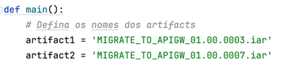
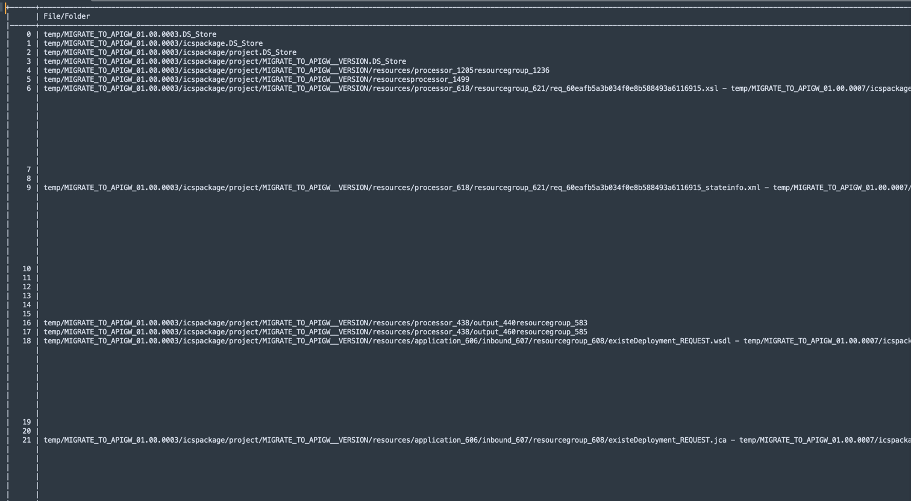
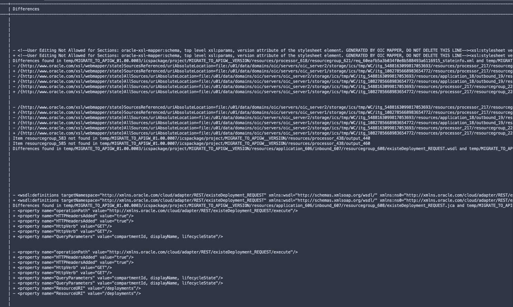

# Analyzing Differences in Oracle Integration Cloud Artifacts

### Introduction
When developing integrations in Oracle Integration Cloud (OIC), artifacts are created with encapsulated metadata definitions. This script helps analyze differences between artifacts, making it easier to understand changes between versions.

### Pre-Requisites

Install these Python libraries:

    pandas
    tabulate

### The code

You can find the code here: [oic_python_compare.py](./source/oic_python_compare.py)

You can execute the code changing the name of the artifacts:

You can change the code to accept parameters if you intend to use with any automation process.

### How the Script Works
The script compares two `.iar` artifacts by extracting and analyzing their contents. The key functionalities include:

1. **Creating Temporary Copies:**
    - Copies the original artifacts into a temporary directory to avoid modifying the original files.

2. **Extracting Files:**
    - Converts `.iar` files into `.zip` format and extracts them into designated folders.

3. **Renaming Versioned Folders:**
    - Standardizes folder names by replacing version numbers with `_VERSION` to simplify comparisons.

4. **Comparing Files:**
    - Analyzes different file formats, including:
        - **Text files**: Compares line-by-line differences.
        - **Properties files**: Identifies key-value changes.
        - **JSON files**: Recursively checks for modifications in structured data.
        - **XML files**: Compares attributes, elements, and text content.

5. **Comparing Directories:**
    - Iterates through both artifact directories and reports missing or modified files.

6. **Generating a Comparison Report:**
    - Outputs a structured table with detected differences.

7. **Cleaning Up Temporary Files:**
    - Removes extracted and temporary files after execution.

### Practical Use Case
Imagine two versions of an integration:
- `MIGRATE_TO_APIGW_01.00.0003.iar`
- `MIGRATE_TO_APIGW_01.00.0007.iar`

By running the script, developers can identify exactly what changed between these versions, aiding in debugging and version control.

## Disclaimer

This code is not supported by Oracle and is provided solely as a snippet for the OIC community. It is intended for informational and educational purposes only. Use at your own discretion and risk.

## Conclusion
This script provides an automated way to compare Oracle Integration artifacts, saving time and reducing errors when managing integration changes. By identifying modifications in metadata, configurations, and logic, teams can ensure seamless updates and deployments.

## Acknowledgments

- **Author** - Cristiano Hoshikawa (Oracle LAD A-Team Solution Engineer)
